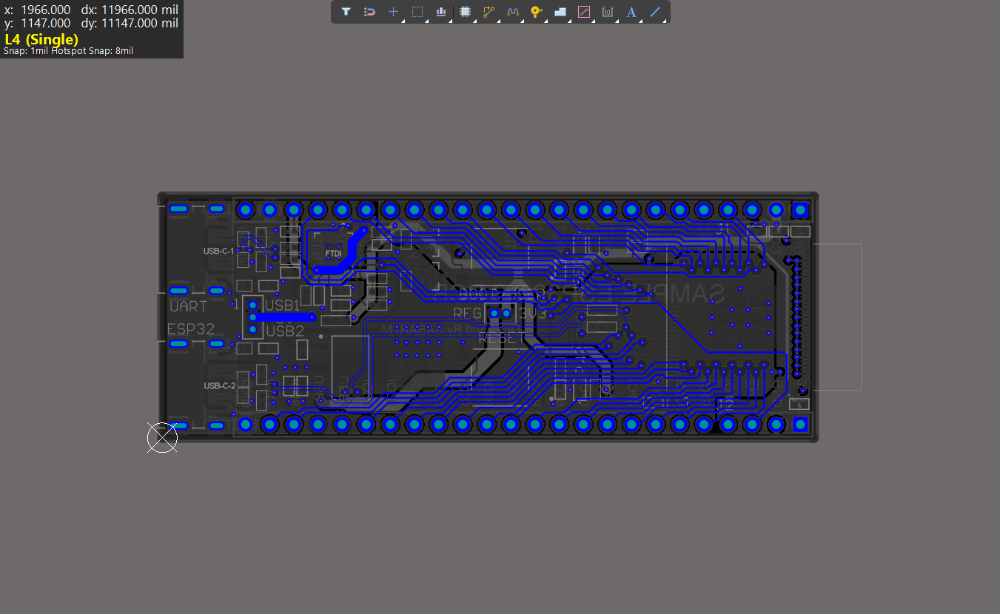

# CUSTOM ESP32-S3 MINI BOARD WITH USB TYPE C

Designed a four layer PCB ESP32-S3 mini board with USB C in the Altium Software . 
- **Microcontroller**: ESP32-S3 Mini
- **USB Interface**: USB Type-C for power and programming
- **Software Used** : Altium

## Default

## Layer-1

## Layer-2

## Layer-3

## Layer-4

## 3-D Model

## Reference
[Youtube Tutorial](https://youtu.be/KWIzhbQaZZk?feature=shared)

## Files
THE GENERATED FILES SUCH AS JOB,BOM,GERBER Etc.,ARE UPLOADED CHECK IT OUT IN THIS REPOSITORY.

## License
This project is open-source under the MIT License.

